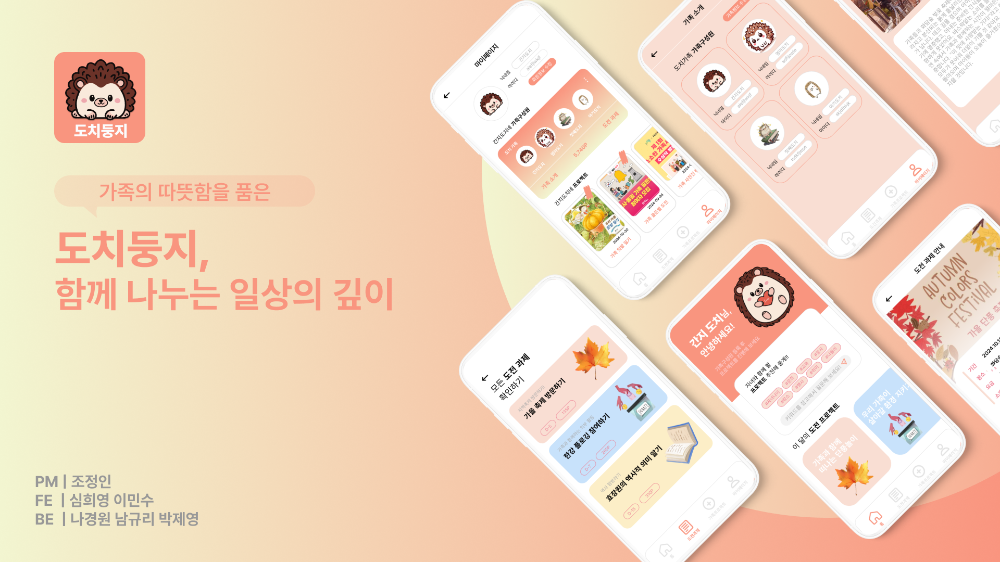

# 도치둥지 (Dochidungji)
> 가족의 따뜻함을 품은, 함께 나누는 일상의 깊이

  

  🏆 2024 Ganzithon PYTHON — 3등 우수상

---
 

## 서비스 소개
현대 사회에는 **다양한 가족 형태**가 존재합니다. *도치둥지*는 변화된 환경 속에서 가족 간 **소통과 감정 공유를 돕는 공간**입니다.  
가족 구성원이 함께 참여하는 **도전 과제(“도파민 프로젝트”)**와 각 가족의 스토리를 담는 **스핀오프 프로젝트**를 통해,  
일상의 소소한 순간부터 특별한 추억까지 **깊이 있는 유대감**을 만들어갑니다.

> 서비스명 ‘도치둥지’는 **고슴도치(도치)의 자식 사랑**과 **단란한 가족의 둥지**에서 영감을 받아 지었습니다.

 

## 주요 기능
- **AI 기반 추천**
  - 구성원 특성과 관심사에 맞춘 **프로젝트/도전과제 추천**.
- **도전과제(챌린지)**
  - 주간/월간 도전과제 확인 및 수행 기록.
  - 완료 시 포인트 적립 *(포인트 정책은 단계적 적용)*.
- **가족 프로젝트 생성**
  - 가족이 직접 프로젝트를 만들고 함께 진행.
  - 생성 시 **포인트 보상(예정)**, 마이페이지에서 누적 포인트 확인.
- **가족 구성원 관리**
  - 대표자 생성 후 가족 그룹명 지정, **구성원 ID 조회/등록**.
  - 마이페이지에서 구성원 정보 수정 가능.
- **마이페이지**
  - 회원/가족 정보 관리, **도전과제 & 가족 프로젝트 내역** 확인.
  - 포인트 내역/제휴 이벤트 & 혜택(확장 예정).

---
 

## 프로토타입 흐름
1. **회원가입 & 첫 로그인**
   - 대표 사용자는 **가족 그룹명**을 정하고 구성원 **ID 조회 후 등록**.
2. **메인 홈**
   - **AI 추천 프로젝트/도전과제** 노출.
3. **도전과제 페이지**
   - 도전과제 확인/작성 → 완료 시 **포인트 적립(예정)**.
4. **가족 프로젝트 생성**
   - 가족 주도 프로젝트 생성 → **보상 포인트** → 마이페이지에서 확인.
5. **마이페이지**
   - 회원/가족 정보 수정, **도전/프로젝트 수행 내역** 및 **포인트/제휴 혜택** 확인.
 

---
 

## 기술 스택

### 프론트엔드

  
  
  
  
  
  

### 기획/디자인

  

### 백엔드

  
  
  
  
  
  

 

## 팀원 소개

| 이름 | 역할 | 역할 |
|---|---|---|
| 심희영 | 팀장 · 프론트엔드 |  |
| 이민수 | 프론트엔드 |  |
| 조정인 | 기획/디자인 |  |
| 나경원 | 백엔드 |  |
| 남규리 | 백엔드 |  |
| 박제영 | 백엔드 |  |

 

## 시연 영상

  <a href="https://www.youtube.com/watch?v=j8jAT1vMnSU"><strong>▶ 시연 영상 보러 가기</strong></a>

 

